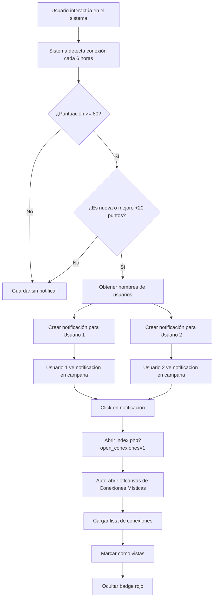

# 🔔 Sistema de Alertas de Coincidencias (Coincidence Alerts)

## 📋 Descripción General

El **Sistema de Alertas de Coincidencias** es una mejora del sistema de Conexiones Místicas que envía **notificaciones automáticas** cuando se detecta una **coincidencia significativa** entre usuarios.

Este sistema motiva la **interacción inmediata** al alertar a los usuarios sobre conexiones especiales con alta compatibilidad.

---

## ✨ Características Principales

### 1. **Detección Automática**
- Se activa cuando una conexión alcanza **≥80% de puntuación**
- Se envía solo cuando es **nueva** o cuando hay una **mejora significativa** (+20 puntos)
- Funciona con las 4 detecciones del sistema:
  - 💫 **Gustos Compartidos** (reacciones a publicaciones similares)
  - 🎯 **Intereses Comunes** (comentarios en publicaciones similares)
  - 🌟 **Amigos de Amigos** (conexiones a través de amigos mutuos)
  - 🌙 **Horarios Coincidentes** (patrones de actividad similares)

### 2. **Notificaciones Bidireccionales**
- Se notifica a **ambos usuarios** simultáneamente
- Cada usuario recibe mensaje personalizado con:
  - Nombre del otro usuario
  - Porcentaje de coincidencia
  - Descripción de la conexión
  - Emoji representativo del tipo

### 3. **Integración con Sistema de Notificaciones**
- Aparece en el **campana de notificaciones** junto a otras alertas
- Se identifica como tipo `conexion_mistica`
- Al hacer clic, abre el **panel de Conexiones Místicas**
- Parámetro `?open_conexiones=1` abre automáticamente el offcanvas

---

## 🛠️ Implementación Técnica

### Archivos Modificados

#### 1. **app/models/notificaciones-triggers.php** (Nuevo método)
```php
public function coincidenciaSignificativa(
    $usuario1_id, 
    $usuario2_id, 
    $tipo_conexion, 
    $descripcion, 
    $puntuacion, 
    $nombre_usuario1, 
    $nombre_usuario2
)
```

**Funcionalidad:**
- Valida que `$puntuacion >= 80`
- Determina emoji según tipo de conexión
- Crea notificación para ambos usuarios
- URL: `/Converza/app/view/index.php?open_conexiones=1`

**Ejemplo de mensaje:**
```
¡Conexión Mística! 💫 Tienes una coincidencia del 100% con María López. 
¡Ambos reaccionaron a 5 publicaciones similares! 💫
```

#### 2. **app/models/conexiones-misticas-usuario-helper.php** (Método modificado)
```php
private function guardarConexion($otroUsuarioId, $tipo, $descripcion, $puntuacion)
```

**Mejoras:**
- Verifica si la conexión ya existe
- Compara puntuación anterior vs nueva
- Llama a `enviarNotificacionCoincidencia()` si cumple criterios
- Nuevo método privado: `enviarNotificacionCoincidencia()`

**Lógica de activación:**
```php
if ($puntuacion >= 80 && 
    ($es_nueva_conexion || ($puntuacion - $puntuacion_anterior) >= 20)) {
    // Enviar notificación
}
```

#### 3. **app/view/_navbar_panels.php** (Auto-abrir offcanvas)
```javascript
document.addEventListener('DOMContentLoaded', function() {
    const urlParams = new URLSearchParams(window.location.search);
    if (urlParams.get('open_conexiones') === '1') {
        const bsOffcanvas = new bootstrap.Offcanvas(offcanvasElement);
        bsOffcanvas.show();
        // Limpiar parámetro de URL
    }
});
```

---

## 🎯 Flujo de Funcionamiento



---

## 📊 Criterios de Notificación

### ¿Cuándo se envía una notificación?

| Condición | Descripción | Ejemplo |
|-----------|-------------|---------|
| **Puntuación ≥ 80** | Coincidencia significativa | Usuario con 100% de gustos compartidos |
| **Nueva conexión** | Primera vez que se detecta | Primera interacción común |
| **Mejora +20 puntos** | Incremento significativo | De 65% a 85% |

### ¿Cuándo NO se envía?

❌ Puntuación < 80 (ej: 60%)  
❌ Conexión existente sin cambios  
❌ Mejora pequeña (ej: de 85% a 90%)

---

## 💻 Ejemplo de Uso

### Escenario 1: Primera Detección
```
Usuario A y Usuario B reaccionan a 5 publicaciones iguales
→ Puntuación: 100% (5 * 20 pts = 100)
→ Es nueva conexión: SÍ
→ Resultado: ✅ SE ENVÍA NOTIFICACIÓN A AMBOS
```

### Escenario 2: Mejora Significativa
```
Conexión existente: 65%
Nueva detección: 85% (+20 pts)
→ Puntuación >= 80: SÍ
→ Mejora >= 20: SÍ
→ Resultado: ✅ SE ENVÍA NOTIFICACIÓN A AMBOS
```

### Escenario 3: Sin Cambios
```
Conexión existente: 90%
Nueva detección: 90% (sin cambios)
→ Resultado: ❌ NO SE ENVÍA (ya notificado)
```

---

## 🎨 Interfaz de Usuario

### Notificación en Campana
```html
<div class="notification">
    <div class="notification-icon">💫</div>
    <div class="notification-content">
        <strong>¡Conexión Mística!</strong> 💫 
        Tienes una coincidencia del 100% con <strong>María López</strong>. 
        ¡Ambos reaccionaron a 5 publicaciones similares! 💫
    </div>
    <div class="notification-time">Hace 2 minutos</div>
</div>
```

### Panel de Conexiones Místicas (Auto-abierto)
Al hacer clic en la notificación:
1. Redirige a `index.php?open_conexiones=1`
2. Offcanvas se abre automáticamente
3. Muestra lista completa de conexiones
4. Marca todas como vistas
5. Badge rojo desaparece

---

## 🔧 Configuración

### Variables Clave

| Variable | Valor | Ubicación |
|----------|-------|-----------|
| `$puntuacion >= 80` | Umbral para notificar | `conexiones-misticas-usuario-helper.php` línea 177 |
| `($puntuacion - $puntuacion_anterior) >= 20` | Mejora mínima | `conexiones-misticas-usuario-helper.php` línea 177 |
| `open_conexiones=1` | Parámetro URL | `notificaciones-triggers.php` línea 305 |

### Personalización

Para cambiar el umbral de notificación:
```php
// En conexiones-misticas-usuario-helper.php línea 177
if ($puntuacion >= 90) { // Cambiar de 80 a 90 para ser más selectivo
```

Para cambiar el incremento mínimo:
```php
// En conexiones-misticas-usuario-helper.php línea 177
|| ($puntuacion - $puntuacion_anterior) >= 30 // Cambiar de 20 a 30
```

---

## 📈 Beneficios

### Para Usuarios
✅ **Descubrimiento proactivo** de conexiones especiales  
✅ **Notificación inmediata** sin necesidad de buscar manualmente  
✅ **Motivación para interactuar** con usuarios afines  
✅ **Experiencia gamificada** con porcentajes y emojis

### Para la Plataforma
✅ **Mayor engagement** entre usuarios  
✅ **Aumento de interacciones** (mensajes, reacciones, comentarios)  
✅ **Retención mejorada** al mostrar valor agregado  
✅ **Serendipity automatizado** sin intervención manual

---

## 🧪 Testing

### Casos de Prueba

1. **Test 1: Primera Coincidencia Alta**
   - Usuario A y B reaccionan a 5 publicaciones iguales
   - Ejecutar detección
   - ✅ Verificar notificación en ambos usuarios
   - ✅ Verificar que abre offcanvas al hacer clic

2. **Test 2: Mejora Significativa**
   - Crear conexión manual con puntuación 65
   - Usuario A y B comentan en 3 publicaciones más
   - Ejecutar detección
   - ✅ Verificar nueva notificación (puntuación subió a 90)

3. **Test 3: Sin Notificación (Puntuación Baja)**
   - Usuario A y B reaccionan a 2 publicaciones
   - Puntuación: 40%
   - ✅ Verificar que NO hay notificación

4. **Test 4: Auto-abrir Offcanvas**
   - Visitar `index.php?open_conexiones=1`
   - ✅ Verificar que offcanvas se abre automáticamente
   - ✅ Verificar que parámetro se elimina de URL

---

## 🚀 Instalación

### Pasos (Ya Completados)

1. ✅ Método `coincidenciaSignificativa()` agregado a `NotificacionesTriggers`
2. ✅ Método `enviarNotificacionCoincidencia()` agregado a `ConexionesMisticasUsuario`
3. ✅ Lógica de detección modificada en `guardarConexion()`
4. ✅ Auto-abrir offcanvas implementado en `_navbar_panels.php`

### No Requiere Cambios en Base de Datos
- Usa tabla `notificaciones` existente
- Usa tabla `conexiones_misticas` existente
- No requiere migraciones

---

## 📝 Mantenimiento

### Monitoreo
- Revisar logs de errores: `error_log` en PHP
- Verificar cantidad de notificaciones enviadas
- Analizar tasa de clics en notificaciones

### Ajustes Futuros
- Considerar umbral dinámico según actividad del usuario
- Agregar preferencias de notificación (activar/desactivar)
- Implementar límite diario de notificaciones (ej: máximo 5 por día)

---

## 🎉 Conclusión

El **Sistema de Alertas de Coincidencias** completa la funcionalidad de Conexiones Místicas al:

✅ **Automatizar** el descubrimiento de conexiones especiales  
✅ **Notificar proactivamente** a usuarios cuando ocurra algo significativo  
✅ **Motivar interacciones** inmediatas con alta compatibilidad  
✅ **Integrar perfectamente** con el sistema de notificaciones existente  
✅ **Mantener simplicidad** sin nuevas tablas ni migraciones complejas

---

**Fecha de implementación:** Enero 2025  
**Versión:** 1.0  
**Estado:** ✅ Completado y funcional
