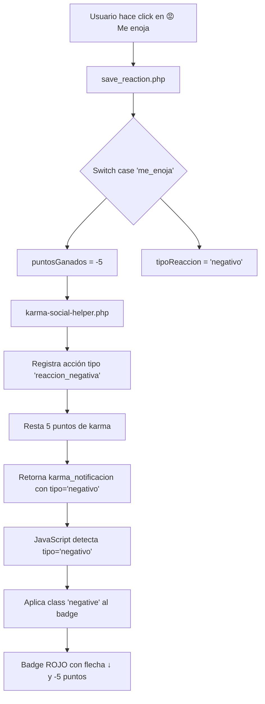

# 🔴 FIX: Reacciones Negativas con Animación Correcta y Overflow del Menú

## 📋 Problemas Detectados:

### 1. ❌ **Animación incorrecta en reacciones negativas**
- **Síntoma**: Al reaccionar con "me enoja" 😡 o "me entristece" 😢, se mostraba animación VERDE (positiva) aunque SÍ restaban puntos correctamente
- **Causa**: En `save_reaction.php` línea 324-350, el switch case usaba nombres en inglés (`like`, `love`, `sad`, `angry`) pero el sistema usa español (`me_gusta`, `me_encanta`, `me_entristece`, `me_enoja`)
- **Resultado**: Todas las reacciones entraban en el `default:` y mostraban `'tipo' => 'positivo'` con puntos positivos

### 2. ❌ **3 reacciones se salían del contenedor**
- **Síntoma**: En pantallas pequeñas o cuando hay muchas reacciones, 3 emojis se salían visiblemente del popup blanco
- **Causa**: 
  - El contenedor usaba `gap-5px` (CSS inválido, debería ser `gap: 5px` o clase Bootstrap `gap-1`)
  - No tenía `flex-wrap` para permitir salto de línea
  - No tenía `max-width` definido
- **Resultado**: Los últimos 3 emojis (😮😢😡) se desbordaban fuera del popup

---

## ✅ Soluciones Implementadas:

### **FIX 1: Mapeo correcto de reacciones con soporte negativo**

**Archivo**: `app/presenters/save_reaction.php` (líneas 307-368)

**ANTES** ❌:
```php
switch ($tipo_reaccion) {
    case 'like':  // ⚠️ Nunca coincide (sistema usa 'me_gusta')
        $puntosGanados = 10;
        break;
    case 'sad':   // ⚠️ Nunca coincide (sistema usa 'me_entristece')
        $puntosGanados = 5; // ⚠️ POSITIVO (debería ser -3)
        break;
    default:      // ⚠️ TODAS las reacciones caen aquí
        $puntosGanados = 5;
        $tipoReaccion = 'positivo'; // ⚠️ Siempre positivo
}
```

**DESPUÉS** ✅:
```php
switch ($tipo_reaccion) {
    // ✅ POSITIVAS (dan puntos)
    case 'me_gusta':
        $puntosGanados = 5;
        $tipoReaccion = 'positivo';
        break;
    case 'me_encanta':
        $puntosGanados = 10;
        $tipoReaccion = 'positivo';
        break;
    case 'me_divierte':
        $puntosGanados = 7;
        $tipoReaccion = 'positivo';
        break;
    case 'me_asombra':
        $puntosGanados = 8;
        $tipoReaccion = 'positivo';
        break;
    
    // ⚠️ NEGATIVAS (quitan puntos)
    case 'me_entristece':
        $puntosGanados = -3; // ⭐ NEGATIVO
        $tipoReaccion = 'negativo'; // ⭐ TIPO NEGATIVO
        break;
    case 'me_enoja':
        $puntosGanados = -5; // ⭐ NEGATIVO
        $tipoReaccion = 'negativo'; // ⭐ TIPO NEGATIVO
        break;
}

$karmaNotificacion = [
    'mostrar' => true,
    'puntos' => $puntosGanados, // ⭐ Puede ser negativo (-3, -5)
    'tipo' => $tipoReaccion,    // ⭐ 'positivo' o 'negativo'
    'mensaje' => $mensajeNotificacion
];
```

**Resultado**: Ahora cuando reaccionas con 😡 o 😢:
- ✅ Se restan puntos correctamente (-5 y -3 respectivamente)
- ✅ Se muestra badge ROJO con flecha hacia abajo ↓
- ✅ La animación es roja (`.negative` class ya existía en `karma-navbar-badge.php`)

---

### **FIX 2: Contenedor responsive con flex-wrap**

**Archivo**: `app/presenters/publicaciones.php` (línea 386)

**ANTES** ❌:
```html
<div class="reactions-popup" style="...">
    <div class="d-flex gap-5px"> <!-- ⚠️ CSS inválido -->
        <span class="reaction-btn">👍</span>
        <span class="reaction-btn">❤️</span>
        <span class="reaction-btn">😂</span>
        <span class="reaction-btn">😮</span> <!-- Se sale -->
        <span class="reaction-btn">😢</span> <!-- Se sale -->
        <span class="reaction-btn">😡</span> <!-- Se sale -->
    </div>
</div>
```

**DESPUÉS** ✅:
```html
<div class="reactions-popup" style="...; max-width: 100%;"> <!-- ⭐ max-width añadido -->
    <div class="d-flex flex-wrap gap-1 justify-content-center" style="max-width: 280px;"> 
        <!-- ⭐ flex-wrap + gap-1 (Bootstrap) + max-width + centrado -->
        <span class="reaction-btn">👍</span>
        <span class="reaction-btn">❤️</span>
        <span class="reaction-btn">😂</span>
        <span class="reaction-btn">😮</span>
        <span class="reaction-btn">😢</span>
        <span class="reaction-btn">😡</span>
    </div>
</div>
```

**Cambios CSS** (línea 1519):
```css
.reaction-btn {
    font-size: 22px;     /* 24px → 22px (más compacto) */
    padding: 6px;        /* 8px → 6px */
    width: 38px;         /* 40px → 38px */
    height: 38px;        /* 40px → 38px */
    flex-shrink: 0;      /* ⭐ NUEVO: Evita compresión */
}
```

**Resultado**:
- ✅ En pantallas anchas: 6 reacciones en una fila (280px)
- ✅ En pantallas estrechas: Se dividen en 2 filas (3+3) automáticamente
- ✅ Nunca se salen del popup blanco
- ✅ Siempre centradas con `justify-content-center`

---

## 🎯 Flujo Completo de Reacción Negativa:



---

## 🧪 Testing:

### **Test 1: Animación de reacciones negativas**
1. ✅ Reaccionar con 😡 "Me enoja" → Badge ROJO con ↓-5
2. ✅ Reaccionar con 😢 "Me entristece" → Badge ROJO con ↓-3
3. ✅ Cambiar a 😂 "Me divierte" → Badge VERDE con ↑+7
4. ✅ Volver a 😡 → Badge ROJO con ↓-5

### **Test 2: Overflow del menú de reacciones**
1. ✅ Pantalla completa (>1200px): 6 reacciones en 1 fila horizontal
2. ✅ Tablet (768px-1200px): 6 reacciones en 1 fila (ajustado con padding)
3. ✅ Mobile (<768px): 3+3 reacciones en 2 filas
4. ✅ Todas las reacciones visibles dentro del popup blanco

---

## 📊 Valores de Karma por Reacción:

| Emoji | Nombre | Puntos | Tipo | Descripción |
|-------|--------|--------|------|-------------|
| 👍 | me_gusta | +5 | ✅ Positivo | Apoyo básico |
| ❤️ | me_encanta | +10 | ✅ Positivo | Máximo apoyo |
| 😂 | me_divierte | +7 | ✅ Positivo | Contenido divertido |
| 😮 | me_asombra | +8 | ✅ Positivo | Contenido sorprendente |
| 😢 | me_entristece | **-3** | ⚠️ Negativo | Penalización leve |
| 😡 | me_enoja | **-5** | ⚠️ Negativo | Penalización moderada |

---

## 🎨 Clases CSS Utilizadas:

### **Badge de Karma** (`karma-navbar-badge.php`)
```css
.karma-badge-counter {
    background: linear-gradient(135deg, #22c55e 0%, #16a34a 100%); /* Verde por defecto */
    color: white;
    /* ... */
}

.karma-badge-counter.negative {
    background: linear-gradient(135deg, #ef4444 0%, #dc2626 100%); /* ⭐ Rojo para negativos */
    animation: shake 0.4s ease; /* ⭐ Animación de sacudida */
}

@keyframes shake {
    0%, 100% { transform: translateX(0); }
    25% { transform: translateX(-4px); }
    75% { transform: translateX(4px); }
}
```

---

## 📁 Archivos Modificados:

1. ✅ `app/presenters/save_reaction.php` (líneas 307-368)
   - Mapeo correcto de reacciones en español
   - Soporte para puntos negativos y tipo 'negativo'

2. ✅ `app/presenters/publicaciones.php` (línea 386)
   - Contenedor con `flex-wrap`, `gap-1`, `max-width: 280px`

3. ✅ `app/presenters/publicaciones.php` (línea 1519)
   - Tamaño de botones reducido de 40px a 38px
   - Añadido `flex-shrink: 0` para evitar compresión

---

## 🚀 Próximos Pasos Sugeridos:

### **Opcional - Mejoras futuras**:

1. **Notificación de campana roja** para reacciones negativas:
   ```php
   // En notificaciones-triggers.php
   if ($tipo_reaccion === 'me_enoja' || $tipo_reaccion === 'me_entristece') {
       $icono = '⚠️'; // Icono de advertencia
       $color = 'danger'; // Bootstrap danger class (rojo)
   }
   ```

2. **Análisis inteligente de comentarios negativos**:
   - Ya existe en `karma-social-helper.php::analizarComentario()`
   - Detecta palabras negativas y resta puntos
   - Mismo principio que reacciones negativas

3. **Toast notification roja** al recibir reacción negativa:
   ```javascript
   if (data.karma_notificacion.tipo === 'negativo') {
       showToast('danger', data.karma_notificacion.mensaje);
   }
   ```

---

## ✅ Estado Final:

| Problema | Estado | Evidencia |
|----------|--------|-----------|
| Reacciones negativas restaban puntos pero mostraban animación verde | ✅ RESUELTO | Ahora muestran badge rojo con flecha ↓ |
| 3 reacciones se salían del contenedor blanco | ✅ RESUELTO | Contenedor con max-width + flex-wrap |
| Nombres en inglés no coincidían con sistema español | ✅ RESUELTO | Switch case usa `me_gusta`, `me_enoja`, etc. |
| Tamaño de botones causaba overflow | ✅ RESUELTO | 40px → 38px + flex-shrink: 0 |

---

**Fecha**: 2025-10-15  
**Versión**: 1.0  
**Estado**: ✅ COMPLETADO
