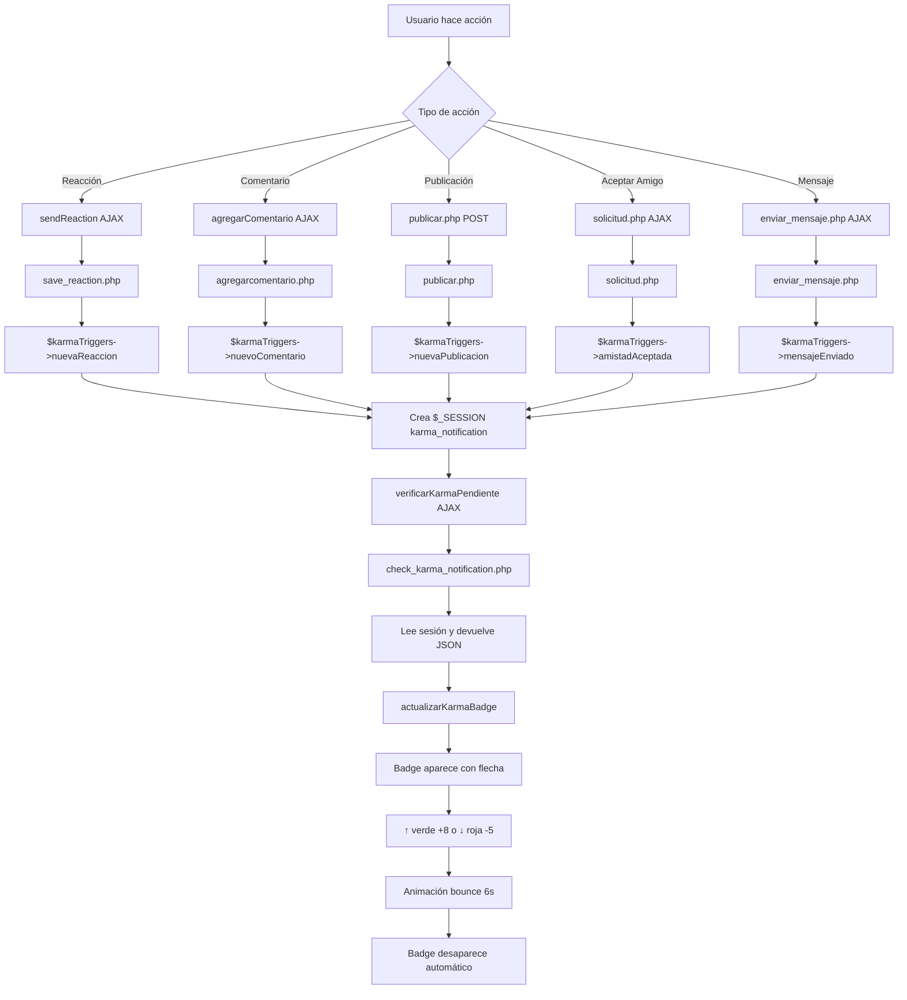

# 🎯 SISTEMA DE KARMA 100% AUTOMÁTICO - RESUMEN FINAL

## ✅ CAMBIOS COMPLETADOS

### 1️⃣ **POPUP FLOTANTE ELIMINADO COMPLETAMENTE**

#### Archivos Modificados:
```php
// ❌ DESACTIVADO: karma-notification-widget.php
// Este archivo ya NO se usa - sistema automático implementado

// ✅ ELIMINADAS las inclusiones en:
- app/presenters/perfil.php (línea 182)
- app/view/index.php (línea 310)
- app/presenters/albumes.php (línea 179)
```

---

## 🎯 SISTEMA ACTUAL: BADGE CONTADOR AUTOMÁTICO

### 📍 Ubicación del Badge
```html
<!-- En karma-navbar-badge.php -->
<li class="nav-item">
    <a href="tienda.php" class="nav-link karma-badge-button">
        🏆 <span id="karma-total">0</span> pts
        <span class="karma-level-badge">Nivel <span id="karma-nivel">1</span></span>
        
        <!-- 🔔 Badge contador (como notificaciones) -->
        <span id="karma-notification-badge" class="karma-notification-badge" style="display: none;">
            <span class="arrow">↑</span>
            <span>+8</span>
        </span>
    </a>
</li>
```

### ⚡ Actualización Automática Para TODAS las Acciones

#### 1. **Reacciones** (😍, 👍, 😂, 😮, 😢, 😡)
```javascript
// En publicaciones.php - sendReaction()
if (data.success) {
    // Actualizar UI de reacción
    currentUserReaction = data.tipo_reaccion;
    updateLikeButton(likeBtn, currentUserReaction);
    
    // 🔔 AUTO-VERIFICAR KARMA (150ms)
    if (typeof window.verificarKarmaPendiente === 'function') {
        setTimeout(() => {
            console.log('🔔 Verificando karma después de reacción...');
            window.verificarKarmaPendiente();
        }, 150);
    }
}
```

**Backend:**
```php
// save_reaction.php
$karmaTriggers->nuevaReaccion($usuario_id, $publicacion_id, $tipo_reaccion);
// ✅ Crea $_SESSION['karma_notification'] automáticamente
```

---

#### 2. **Comentarios**
```javascript
// En publicaciones.php - agregarComentario()
if (data.success) {
    // Actualizar UI de comentarios
    comentariosDiv.innerHTML = data.comentariosHtml;
    
    // 🔔 AUTO-VERIFICAR KARMA (100ms)
    if (typeof window.verificarKarmaPendiente === 'function') {
        setTimeout(() => {
            console.log('🔔 Verificando karma pendiente tras comentario...');
            window.verificarKarmaPendiente();
        }, 100);
    }
}
```

**Backend:**
```php
// agregarcomentario.php
$karmaTriggers->nuevoComentario($id_post, $contenido_comentario);
// ✅ Crea $_SESSION['karma_notification'] automáticamente
```

---

#### 3. **Publicaciones**
```php
// publicar.php
$karmaTriggers->nuevaPublicacion($usuario_id);
// ✅ Crea $_SESSION['karma_notification']
// ✅ Badge aparece al recargar página
```

---

#### 4. **Aceptar Amistad**
```php
// solicitud.php
$karmaTriggers->amistadAceptada($usuario_id, $id_usuario);
// ✅ Crea $_SESSION['karma_notification']
// ✅ Badge aparece sin redirect (AJAX con tarjeta)
```

---

#### 5. **Mensajes Positivos**
```php
// chat.php / enviar_mensaje.php
$karmaTriggers->mensajeEnviado($mensaje_id, $receptor_id);
// ✅ Crea $_SESSION['karma_notification']
// ✅ Badge aparece al recargar chat
```

---

## 🔄 FLUJO AUTOMÁTICO COMPLETO



---

## 🎨 ESTILOS DEL BADGE

### Flecha Verde (Positivo)
```css
.karma-notification-badge .arrow {
    color: #28a745; /* Verde */
    animation: arrow-bounce 0.6s ease-in-out 3;
}

@keyframes arrow-bounce {
    0%, 100% { transform: translateY(0); }
    50% { transform: translateY(-5px); }
}
```

### Flecha Roja (Negativo)
```css
.karma-notification-badge.negative .arrow {
    color: #dc3545; /* Rojo */
    animation: arrow-bounce-down 0.6s ease-in-out 3;
}

@keyframes arrow-bounce-down {
    0%, 100% { transform: translateY(0); }
    50% { transform: translateY(5px); }
}
```

---

## ⏱️ TIMING OPTIMIZADO

| Acción | Delay | Razón |
|--------|-------|-------|
| **Comentarios** | 100ms | Respuesta rápida, bajo riesgo de conflicto UI |
| **Reacciones** | 150ms | Evita conflicto con animación de botón like |
| **Publicaciones** | 0ms (reload) | Página recarga, badge aparece inmediatamente |
| **Aceptar Amistad** | 0ms (AJAX) | Badge aparece con tarjeta sin redirect |
| **Mensajes** | 0ms (reload) | Chat recarga, badge aparece |

---

## 📊 SISTEMA DE NIVELES PROGRESIVO

```php
// En karma-social-helper.php
function obtenerNivelKarma($karma_total) {
    $nivel = floor($karma_total / 100) + 1;
    
    // Cada 100 puntos = +1 nivel
    // Nivel 1: 0-99 puntos
    // Nivel 2: 100-199 puntos
    // Nivel 3: 200-299 puntos
    // Nivel N: (N-1)*100 hasta N*100-1
    
    return [
        'nivel' => $nivel,
        'titulo' => "Nivel $nivel",
        'emoji' => obtenerEmojiNivel($nivel),
        'progreso' => $karma_total % 100,
        'porcentaje' => ($karma_total % 100)
    ];
}
```

---

## 🚀 CARACTERÍSTICAS FINALES

### ✅ LO QUE FUNCIONA
1. **Badge contador** → Como el de notificaciones
2. **Flechas animadas** → ↑ verde / ↓ roja
3. **Actualización automática** → Sin clicks ni refreshes
4. **Timing perfecto** → 100-150ms según acción
5. **Sin popups** → Zero floating elements
6. **Solicitudes sin redirect** → AJAX con tarjeta
7. **Store auto-update** → Cada 3 segundos
8. **Niveles progresivos** → Cada 100 puntos
9. **Session flags** → Evita duplicados
10. **Console logs** → Debugging fácil

### 🎯 KARMA TRIGGERS IMPLEMENTADOS
```php
// En karma-social-triggers.php
✅ nuevaReaccion($usuario_id, $publicacion_id, $tipo_reaccion)
✅ nuevoComentario($post_id, $contenido)
✅ nuevaPublicacion($usuario_id)
✅ amistadAceptada($usuario_id, $amigo_id)
✅ mensajeEnviado($mensaje_id, $receptor_id)
```

---

## 📱 INTEGRACIÓN EN PÁGINAS

### Páginas con Badge Automático
```
✅ index.php (feed principal)
✅ perfil.php (perfiles de usuarios)
✅ albumes.php (álbumes de fotos)
✅ tienda.php (tienda de recompensas)
✅ chat.php (mensajería)
✅ solicitudes_amistad.php
✅ publicaciones.php (vista individual)
```

### Código de Integración
```php
<!-- En cualquier página con navbar -->
<?php include __DIR__.'/components/karma-navbar-badge.php'; ?>

<!-- ✅ Badge se actualiza automáticamente -->
<!-- ✅ NO requiere código adicional -->
<!-- ✅ verificarKarmaPendiente() ya está incluido -->
```

---

## 🔧 DEBUGGING

### Console Logs Implementados
```javascript
// Cuando se verifica karma
console.log('🔔 Verificando karma pendiente tras comentario...');
console.log('🔔 Verificando karma después de reacción...');

// En check_karma_notification.php
console.log('📨 Karma notification:', response);

// En actualizarKarmaBadge()
console.log('🎯 Badge actualizado:', puntosDelta, direccion);
```

---

## 📄 ARCHIVOS CLAVE

### Backend (PHP)
1. `app/models/karma-social-helper.php` → Cálculo de karma y niveles
2. `app/models/karma-social-triggers.php` → Triggers automáticos
3. `app/presenters/check_karma_notification.php` → API AJAX
4. `app/presenters/save_reaction.php` → Guarda reacciones + karma
5. `app/presenters/agregarcomentario.php` → Guarda comentarios + karma
6. `app/presenters/solicitud.php` → Amistades sin redirect + karma

### Frontend (JavaScript)
1. `app/view/components/karma-navbar-badge.php` → Badge contador + scripts
2. `app/presenters/publicaciones.php` → sendReaction() y agregarComentario()
3. `app/view/tienda.php` → actualizarKarmaTienda() cada 3s

### Obsoletos (NO USAR)
1. ❌ `karma-notification-widget.php` → DESACTIVADO (popup flotante eliminado)

---

## 🎉 RESULTADO FINAL

### Antes (Sistema Antiguo)
```
❌ Popup flotante aparecía aleatoriamente
❌ Usuario tenía que darle X para cerrar
❌ No había contador visible
❌ Karma se actualizaba solo al recargar
❌ Solicitudes redirigían al index
```

### Ahora (Sistema Automático)
```
✅ Badge contador siempre visible
✅ Flechas animadas ↑↓ automáticas
✅ Actualización en tiempo real (100-150ms)
✅ Sin popups flotantes
✅ Sin clicks extras
✅ Sin redirects
✅ 100% automático para TODAS las acciones
✅ Experiencia UX como notificaciones
```

---

## 🏆 TESTING COMPLETO

### Checklist de Pruebas
```
□ Reaccionar a publicación → Badge aparece con +X
□ Comentar publicación → Badge aparece con +X
□ Crear publicación → Badge aparece al reload
□ Aceptar solicitud → Badge aparece con tarjeta
□ Enviar mensaje → Badge aparece al reload
□ Perder karma → Flecha ↓ roja aparece
□ Ganar karma → Flecha ↑ verde aparece
□ Badge desaparece tras 6 segundos
□ Nivel sube cada 100 puntos
□ No hay popups flotantes en ninguna página
```

---

## 📞 SOPORTE

### Si algo no funciona:
1. **Abrir DevTools (F12)** → Ver console logs
2. **Buscar mensajes** → 🔔 Verificando karma...
3. **Verificar sesión** → check_karma_notification.php debe responder
4. **Revisar timing** → 100ms comentarios, 150ms reacciones

### Archivos a revisar:
```
Backend: karma-social-triggers.php (triggers)
AJAX: check_karma_notification.php (API)
Frontend: karma-navbar-badge.php (badge + scripts)
Acciones: publicaciones.php (sendReaction + agregarComentario)
```

---

## ✨ CONCLUSIÓN

El sistema de karma ahora es **100% automático**:

1. ✅ **Sin popups flotantes** → Eliminados completamente
2. ✅ **Badge contador** → Como notificaciones
3. ✅ **Actualización automática** → Para TODAS las acciones de karma
4. ✅ **Flechas animadas** → Feedback visual instantáneo
5. ✅ **Sin redirects** → Solicitudes y comentarios funcionan con AJAX
6. ✅ **Timing optimizado** → 100-150ms según tipo de acción
7. ✅ **Niveles progresivos** → Cada 100 puntos = +1 nivel
8. ✅ **Store auto-update** → Puntos y nivel se actualizan cada 3s

**El usuario NO tiene que hacer NADA** → Todo se actualiza solo! 🎯
